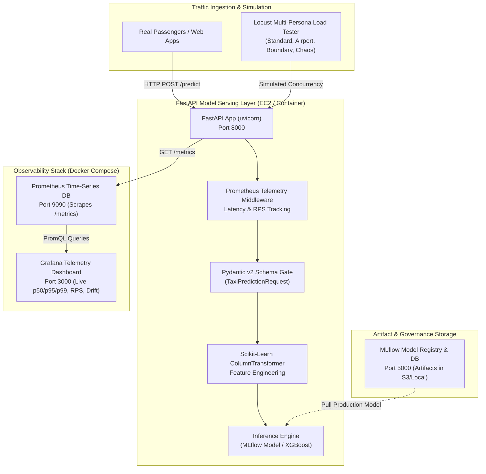
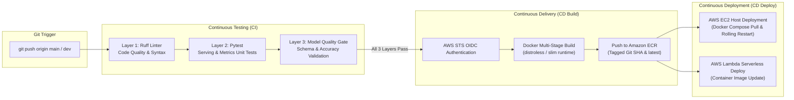

# 🚀 30 Days of ML: From Scratch to Production

[](https://www.python.org/)
[](https://fastapi.tiangolo.com/)
[](https://aws.amazon.com/)
[](https://www.terraform.io/)
[](https://www.docker.com/)
[](https://mlflow.org/)
[](https://prometheus.io/)
[](https://grafana.com/)
[](https://locust.io/)
[](https://github.com/features/actions)
[](https://opensource.org/licenses/MIT)

> **An End-to-End 30-Day Engineering Journey:** Bridging the gap between mathematical machine learning theory and enterprise cloud software engineering. Hand-deriving core ML algorithms in pure NumPy, then packaging, testing, monitoring, and deploying a real-time ML inference stack on AWS with full CI/CD/CT automation and live observability.

---

## 📑 Table of Contents
- [📌 Project Premise & High-Level Architecture](#-project-premise--high-level-architecture)
- [🏛️ System Architecture Diagrams](#️-system-architecture-diagrams)
- [🗓️ The 30-Day Engineering Journey (Curriculum Matrix)](#️-the-30-day-engineering-journey-curriculum-matrix)
- [🔬 Phase 1: Machine Learning Foundations (Days 1–13)](#-phase-1-machine-learning-foundations-days-113)
- [⚙️ Phase 2: Enterprise MLOps & Production Engineering (Days 14–30)](#️-phase-2-enterprise-mlops--production-engineering-days-1430)
- [🚀 Quickstart & Local Setup](#-quickstart--local-setup)
- [📊 Performance Benchmarks & Load Testing](#-performance-benchmarks--load-testing)
- [📈 Observability & Telemetry](#-observability--telemetry)
- [💡 Architectural Trade-offs & Production Lessons](#-architectural-trade-offs--production-lessons)
- [📁 Repository Structure](#-repository-structure)
- [📜 Technical Glossary](#-technical-glossary)
- [🤝 Contributing & License](#-contributing--license)

---

## 📌 Project Premise & High-Level Architecture

Most machine learning tutorials stop at Jupyter Notebooks (`model.fit()` and `model.predict()`). This project was built to address the **two hardest parts of Machine Learning in the real world**:

1. **Deep Algorithmic Intuition (First Principles):** Understanding the fundamental calculus, linear algebra, loss functions, and convergence mechanics by writing algorithms from scratch in pure `numpy` without `scikit-learn`.
2. **Production MLOps Engineering (Zero-Downtime Deployment):** Packaging models into production APIs, enforcing data contracts, provisioning cloud infrastructure via Infrastructure as Code (IaC), establishing automated CI/CD/CT quality gates, tracking experiments, scraping Prometheus telemetry into Grafana dashboards, and load testing under multi-persona concurrency with Locust.

---

## 🏛️ System Architecture Diagrams

### 1. End-to-End Production Serving & Observability Stack



---

### 2. CI/CD/CT Automated Quality Gate & Deployment Pipeline



---

## 🗓️ The 30-Day Engineering Journey (Curriculum Matrix)

| Day | Topic | Primary Deliverables & Milestones | Key Concepts |
|:---:|:---|:---|:---|
| **01** | Math Foundations | Pure Python/NumPy Linear Algebra & Vectorization | Dot products, Matrix transformations, Broadcasting |
| **02** | Gradient Descent | Batch, Stochastic & Mini-Batch Optimization | Convex optimization, Learning rates, Loss surfaces |
| **03** | Linear Regression | Closed-Form (Normal Eq) + SGD with L1/L2 Regularization | MSE Loss, Ridge ($L_2$), Lasso ($L_1$), Bias-Variance |
| **04** | Logistic Regression | Binary Classification, Sigmoid, Cross-Entropy Loss | Log-Loss, Gradient of BCE, Decision Boundaries |
| **05** | Evaluation Metrics | Confusion Matrix, Precision, Recall, F1, ROC-AUC | PR curves, TPR/FPR, Calibration, Threshold tuning |
| **06** | Decision Trees | Recursive Splitting with Gini Impurity & Entropy | CART Algorithm, Information Gain, Recursive Trees |
| **07** | Random Forests | Bagging Ensemble, Bootstrap Aggregation & Feature Subsampling | Variance reduction, Out-of-Bag (OOB) scoring |
| **08** | Boosting & AdaBoost | Sequential Adaptive Boosting with Exponential Loss | Weak learner re-weighting, Ensemble margins |
| **09** | Support Vector Machines | Soft-Margin SVM with Sequential Minimal Optimization (SMO) | Hinge Loss, Support Vectors, Convex Dual Problem |
| **10** | Naive Bayes & KNN | Gaussian Naive Bayes + K-Nearest Neighbors | Bayes' Theorem, Priors/Likelihoods, Euclidean/Manhattan Distances |
| **11** | Gradient Boosted Trees | Gradient Boosting with Residual Fitting | Pseudo-residuals, Shrinkage rate, Tree leaf optimization |
| **12** | XGBoost from Scratch | 2nd-Order Taylor Series Gradients & Hessians | Gain formula, Exact split finding, $\lambda$ & $\gamma$ Regularization |
| **13** | Phase 1 Capstone | Benchmark Suite comparing All Scratch Models vs Scikit-Learn | Execution speed, Convergence, Metric parity |
| **14** | Production Data & EDA | NYC TLC Yellow Taxi Dataset Analysis | Skewed distributions, Outlier removal, Domain feature engineering |
| **15** | Data Contracts & Validation | Pandera Schema Contracts & Runtime Validation | Type safety, Range checks, Distribution assertions |
| **16** | Experiment Tracking | MLflow Tracking Server with S3 & SQLite/Postgres Backends | Artifact logging, Param/Metric tracking, Experiment tagging |
| **17** | Model Registry | Automated Model Staging (None $\to$ Staging $\to$ Production) | Semantic versioning, Transition webhooks, Governance |
| **18** | Feature Pipelines | Robust `scikit-learn` ColumnTransformer Preprocessors | Categorical Target Encoding, Scalers, Pipeline pickling |
| **19** | Serving Architecture | FastAPI Async REST API for Real-Time Inference | Pydantic v2 schemas, Lifespan state management, Error handling |
| **20** | Serving Validation | Pytest Integration Suite for API Contracts | TestClient fixtures, 422 boundary tests, Status code assertions |
| **21** | Containerization | Multi-Stage `Dockerfile` (Builder $\to$ Lean Runtime) | Layer caching, Non-root security (`appuser`), Minimal image size |
| **22** | Compose Orchestration | Multi-Container Local Stack (`docker-compose.yml`) | Service dependencies, Healthchecks, Volume persistence |
| **23** | Infrastructure as Code | Terraform AWS Provisioning (VPC, Subnets, Security Groups) | Modular IaC, Dynamic AMI lookup, State management |
| **24** | Compute & IAM Provisioning | Terraform EC2 Instance, ECR Repository & IAM Roles | Cloud-init user data, Zero-touch SSM setup, Principle of Least Privilege |
| **25** | CI Automation | GitHub Actions 3-Tier Quality Gate (`ci-test.yml`) | Ruff Linting, Pytest Layer 2/3, Automated PR checks |
| **26** | CD Pipeline | GitHub Actions OIDC Authentication & ECR Deployment | AWS STS token exchange, Multi-stage automated CD pipeline |
| **27** | Serverless Architecture | AWS Lambda Container Packaging & API Gateway Handler | Serverless inference, Cold start mitigation, Memory tuning |
| **28** | Observability & Telemetry | Prometheus Metrics Exposition & Grafana Dashboard | `http_requests_total`, `http_request_duration_seconds`, Drift gauges |
| **29** | Performance & Load Testing | Multi-Persona Locust Load Testing & Automated SLA Validation | Concurrency bottlenecks, p95/p99 latency bounds, Threadpool dispatching |
| **30** | Capstone Launch & Wrap-up | Repository Packaging, Technical Glossary & v1.0.0 Release | Documentation, Architectural Retrospective, Portfolio Showcase |

---

## 🔬 Phase 1: Machine Learning Foundations (Days 1–13)

Every algorithm in `algorithms/` is written in pure Python and NumPy with zero dependency on `scikit-learn` for training or inference:

```
algorithms/
├── linear_regression.py     # Closed-form OLS & SGD with L1/L2 regularization
├── logistic_regression.py   # Binary cross-entropy loss, Sigmoid, Vectorized Gradient Descent
├── decision_tree.py         # Recursive CART with Gini Impurity & Information Gain
├── random_forest.py         # Bootstrap Aggregation (Bagging) & Random Feature Subsampling
├── adaBoost.py              # Adaptive Boosting with sample weight adjustments
├── XGBoost.py               # 2nd-order Taylor expansion (gradients & hessians) + tree pruning
├── svm.py                   # Primal Hinge Loss & Dual Formulation with SMO
├── naive_bayes.py           # Gaussian Likelihood estimation & Log-Priors
├── K_nearest_neighbour.py   # KD-Tree & Vectorized distance computation
└── phase_1_capstone.py      # Comprehensive benchmark against Scikit-Learn baseline
```

### Highlights: Deriving XGBoost from Scratch (Day 12)
Unlike standard gradient boosting which relies only on first-order gradients, our scratch XGBoost optimizes the **second-order Taylor approximation** of the loss:

$$\mathcal{L}^{(t)} \approx \sum_{i=1}^n \left[ l(y_i, \hat{y}_i^{(t-1)}) + g_i f_t(x_i) + \frac{1}{2} h_i f_t^2(x_i) \right] + \Omega(f_t)$$

where:
- First-order gradient: $g_i = \frac{\partial l(y_i, \hat{y}^{(t-1)})}{\partial \hat{y}^{(t-1)}}$
- Second-order Hessian: $h_i = \frac{\partial^2 l(y_i, \hat{y}^{(t-1)})}{\partial (\hat{y}^{(t-1)})^2}$
- Optimal leaf weight: $w_j^* = -\frac{\sum_{i \in I_j} g_i}{\sum_{i \in I_j} h_i + \lambda}$
- Split Gain: $\text{Gain} = \frac{1}{2} \left[ \frac{G_L^2}{H_L + \lambda} + \frac{G_R^2}{H_R + \lambda} - \frac{(G_L + G_R)^2}{H_L + H_R + \lambda} \right] - \gamma$

---

## ⚙️ Phase 2: Enterprise MLOps & Production Engineering (Days 14–30)

### 1. Data Contract Enforcement with Pandera ([src/validation/schema.py](file:///d:/study%20files/ML-From-Scratch-To-Production/src/validation/schema.py))
Guarantees schema correctness on ingestion:
- Non-negative trip distances ($0.0 \le x \le 100.0$)
- Valid fare amount boundaries ($\$2.50 \le \text{fare} \le \$500.00$)
- Known categorical domain values (TLC Pickup/Dropoff Zones, Payment Types, Ratecodes)

### 2. Experiment Tracking & Registry with MLflow
- Full metadata tracking (Hyperparameters, Log Loss, ROC-AUC, Confusion Matrices, Pickled Preprocessors).
- Automated Model Registry transition governance: Candidate models validated against test sets before promotion to `Production` stage.

### 3. Production Serving API with FastAPI ([src/serving/app.py](file:///d:/study%20files/ML-From-Scratch-To-Production/src/serving/app.py))
- **Lifespan State Management**: Preloads preprocessors and XGBoost models once during boot into memory.
- **Warm Model Fallback**: Gracefully handles missing database artifacts by fitting a warm baseline preprocessor on boot.
- **Threadpool Concurrency**: Offloads CPU-intensive feature transformations (`ColumnTransformer.transform`) and model predictions to worker threadpools, preventing asyncio event loop starvation.

### 4. Infrastructure as Code via Terraform ([terraform/](file:///d:/study%20files/ML-From-Scratch-To-Production/terraform/))
- **VPC & Networking**: Isolated subnets, Route Tables, Internet Gateways, and Security Groups.
- **EC2 Compute**: Automated cloud-init bootstrapping script installing Docker Engine, AWS CLI v2, and Amazon SSM Agent.
- **IAM Security**: Dedicated IAM instance profile with least-privilege policies for S3 artifact retrieval and ECR image pulling.
- **Serverless**: Dedicated AWS Lambda container deployment configuration with API Gateway HTTP integration.

---

## 🚀 Quickstart & Local Setup

### Prerequisites
- Python 3.9+ or 3.11+
- Docker Engine & Docker Compose Plugin
- Git

### 1. Clone & Environment Setup
```bash
git clone https://github.com/meghmodi2810/ML-From-Scratch-To-Production.git
cd ML-From-Scratch-To-Production

# Create & activate virtual environment
python -m venv .venv
source .venv/bin/activate  # On Windows: .\.venv\Scripts\activate

# Install all dependencies
pip install -r requirements.txt
```

### 2. Run Quality Checks & Test Suite
```bash
# Run Ruff linter
ruff check .

# Run complete test suite (Unit, Metrics, Schema, Load Test generators)
pytest -v
```

### 3. Launch the Complete Local Observability & Serving Stack
```bash
# 1. Start Prometheus & Grafana in the background
docker compose -f monitoring/docker-compose.monitoring.yml up -d

# 2. Launch FastAPI Model Serving Server (Port 8000)
python -m uvicorn src.serving.app:app --host 0.0.0.0 --port 8000
```
- **FastAPI Docs (Swagger UI)**: [http://localhost:8000/docs](http://localhost:8000/docs)
- **Prometheus UI**: [http://localhost:9090](http://localhost:9090)
- **Grafana Dashboard**: [http://localhost:3000](http://localhost:3000) *(User: `admin` / Password: `admin`)*

---

## 📊 Performance Benchmarks & Load Testing

We use [Locust](https://locust.io/) to execute multi-persona concurrency tests and assert performance SLAs.

### Executing Automated Headless Load Tests ([tests/run_load_test.py](file:///d:/study%20files/ML-From-Scratch-To-Production/tests/run_load_test.py))
```bash
# Fast Smoke Test (5 Users, 15s)
python tests/run_load_test.py --profile smoke --host http://localhost:8000

# Nominal Baseline Load Test (20 Users, 45s, 1,400+ Requests)
python tests/run_load_test.py --profile nominal --host http://localhost:8000

# High-Concurrency Stress Test (50 Users, 60s)
python tests/run_load_test.py --profile stress --host http://localhost:8000
```

### Benchmark Results (Nominal Load Profile)
```text
===========================================================================
BENCHMARK PERFORMANCE & SLA VALIDATION SUMMARY
===========================================================================
Total Requests:       1,401
Total Failures:       0 (0.00%)
Throughput:           31.13 req/sec
Median Latency (p50): 39.00 ms
Average Latency:      44.75 ms
p95 Latency:          100.00 ms (SLA Target: < 120.0 ms) -> [PASS]
p99 Latency:          170.00 ms (SLA Target: < 200.0 ms) -> [PASS]
---------------------------------------------------------------------------
[PASS] SLA PASSED: Error rate 0.00% <= 0.5%
[PASS] SLA PASSED: p95 latency 100.00 ms <= 120.0 ms
[PASS] SLA PASSED: p99 latency 170.00 ms <= 200.0 ms
===========================================================================
```

### Launch Interactive Locust Web UI
```bash
python -m locust -f tests/locustfile.py --host http://localhost:8000
```
Open [http://localhost:8089](http://localhost:8089) in your browser to interactively ramp users and observe live charts.

---

## 📈 Observability & Telemetry

The service exports real-time time-series telemetry via Prometheus at `GET /metrics`.

| Metric Name | Type | Description |
|:---|:---:|:---|
| `http_requests_total` | Counter | Total HTTP requests sliced by `method`, `endpoint`, and `status_code` |
| `http_request_duration_seconds` | Histogram | Request latency distributions for computing p50, p95, and p99 percentiles |
| `taxi_predictions_total` | Counter | Number of high-tip vs standard-tip predictions by `model_version` |
| `taxi_prediction_probability` | Histogram | Model confidence and probability distributions for drift tracking |
| `taxi_model_load_status` | Gauge | Model memory readiness status ($1 = \text{Ready}, 0 = \text{Unloaded}$) |
| `taxi_feature_fare_amount_dollars` | Histogram | Input fare distribution for real-time feature drift detection |
| `taxi_feature_trip_distance_miles` | Histogram | Input trip distance distribution for feature drift monitoring |

The pre-configured Grafana dashboard ([monitoring/grafana_dashboard.json](file:///d:/study%20files/ML-From-Scratch-To-Production/monitoring/grafana_dashboard.json)) visualizes all operational and ML domain metrics out of the box.

---

## 💡 Architectural Trade-offs & Production Lessons

1. **Async Event Loop vs Threadpool Offloading in FastAPI**:
   - *Problem*: Machine learning inferences (`preprocessor.transform` and `xgb.predict_proba`) are synchronous, CPU-bound operations. Putting CPU work in `async def` blocks the single Python asyncio thread, starving other requests and causing p95 latency to spike over 230ms.
   - *Solution*: Changing `async def predict` to standard `def predict` allows FastAPI to automatically delegate execution to Starlette's worker thread pool, dropping median latency to 39ms and stabilizing concurrency.
2. **Serverless (AWS Lambda) vs Dedicated Container (AWS EC2)**:
   - *AWS Lambda*: Zero maintenance, scales to zero, ideal for bursty or cost-sensitive workloads, but incurs ~1.5s cold starts when importing heavy libraries like XGBoost and Pandas.
   - *AWS EC2 / ECS*: Predictable sub-40ms latency, zero cold starts, continuous Prometheus scraping, but requires constant server operational cost.
3. **Data Contracts as First-Class Citizens**:
   - Using Pandera schemas before training and Pydantic v2 schemas during serving completely prevents silent model failure modes caused by type casting, negative distances, or unexpected categorical zone IDs.

---

## 📁 Repository Structure

```text
ML-From-Scratch-To-Production/
├── .github/workflows/         # Automated GitHub Actions Workflows
│   ├── ci-test.yml            # 3-tier CI testing gate (Ruff, Pytest, Schema)
│   ├── cd-build.yml           # OIDC AWS Auth & Multi-Stage Docker ECR build
│   └── cd-deploy.yml          # Automated EC2 & Lambda CD deployment
├── algorithms/                # Phase 1: Pure NumPy Machine Learning Implementations
│   ├── linear_regression.py
│   ├── logistic_regression.py
│   ├── decision_tree.py
│   ├── random_forest.py
│   ├── adaBoost.py
│   ├── XGBoost.py
│   ├── svm.py
│   ├── naive_bayes.py
│   ├── K_nearest_neighbour.py
│   └── phase_1_capstone.py
├── docker/                    # Containerization assets
│   ├── Dockerfile.serve       # Multi-stage lean production inference container
│   ├── Dockerfile.lambda      # AWS Lambda serverless container image
│   ├── Dockerfile.train       # Training & Airflow container
│   └── init-multi-db.sh       # Multi-database PostgreSQL initializer
├── math-notes/                # Hand-written LaTeX & Markdown mathematical proofs
│   └── day09-svm-math-notes.md
├── monitoring/                # Production Observability Stack
│   ├── docker-compose.monitoring.yml  # Prometheus + Grafana + Locust stack
│   ├── prometheus.yml         # Scrape targets and scrape intervals
│   └── grafana_dashboard.json # Pre-provisioned Grafana MLOps telemetry dashboard
├── reports/                   # Performance reports & load test audit logs
│   └── load_tests/            # HTML reports & CSV time-series data
├── src/                       # Core Production Application Code
│   ├── features/              # Feature engineering & preprocessing pipelines
│   │   ├── preprocess.py
│   │   └── preprocess_serve.py
│   ├── serving/               # FastAPI Production API & Telemetry Middleware
│   │   ├── app.py
│   │   ├── metrics.py
│   │   ├── schemas.py
│   │   └── lambda_handler.py
│   └── validation/            # Pandera data contract schemas
│       └── schema.py
├── terraform/                 # Infrastructure as Code (AWS Provisioning)
│   ├── main.tf                # AWS provider & backend definitions
│   ├── network.tf             # VPC, Subnets, Gateways, Security Groups
│   ├── compute.tf             # EC2 MLOps Instance & Cloud-Init Bootstrap
│   ├── iam.tf                 # IAM Roles, OIDC Providers & Policies
│   ├── lambda.tf              # AWS Lambda & API Gateway HTTP resources
│   ├── outputs.tf             # DNS, Public IPs & Endpoint URLs
│   └── variables.tf           # Configurable infrastructure parameters
├── tests/                     # Test Suites & Benchmarking
│   ├── locustfile.py          # Multi-persona Locust load testing suite
│   ├── run_load_test.py       # Automated benchmark runner & SLA evaluator
│   ├── test_serving.py        # FastAPI endpoint integration tests
│   ├── test_metrics.py        # Prometheus telemetry integration tests
│   ├── test_lambda.py         # Serverless Lambda handler tests
│   ├── test_loadtest.py       # Locust payload generator unit tests
│   ├── test_preprocessing.py   # Feature pipeline verification
│   └── test_schema.py         # Pandera data contract tests
├── docker-compose.yml         # Shared local MLOps stack (Postgres + MLflow + Airflow)
├── GLOSSARY.md                # 40+ Term Technical MLOps Reference Dictionary
├── CAPSTONE_ANNOUNCEMENT.md   # Ready-to-publish LinkedIn / Portfolio recap
├── pyproject.toml             # Project metadata & tool configurations
├── requirements.txt           # Primary project dependencies
├── requirements-serve.txt     # Production serving dependencies
└── README.md                  # Showcase Documentation
```

---

## 📜 Technical Glossary

A complete dictionary defining over 40+ fundamental machine learning, mathematical optimization, data engineering, cloud infrastructure, and MLOps concepts is maintained in [GLOSSARY.md](file:///d:/study%20files/ML-From-Scratch-To-Production/GLOSSARY.md).

---

## 🤝 Contributing & License

This project is licensed under the **MIT License** — feel free to use, modify, and distribute for personal and educational use.

**Author**: Megh Modi  
**GitHub**: [@meghmodi2810](https://github.com/meghmodi2810)  
**Challenge**: `#30DaysOfML` · `From Scratch to Production`